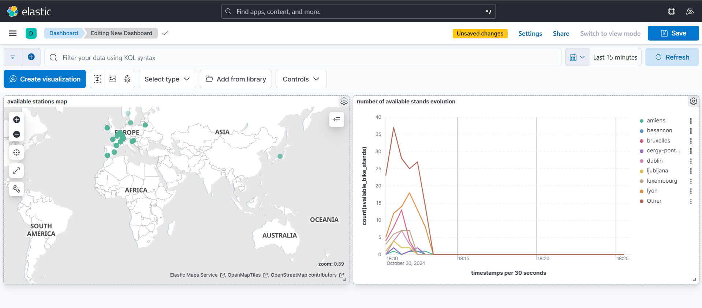

# Real-Time Bike Station Availability Monitoring

The **Real-Time Bike Station Availability Monitoring** is a system designed to track and analyze the status of cycling stations using the JCDecaux API. It utilizes a data pipeline comprising Kafka, Spark, Elasticsearch, and Kibana to process and visualize real-time data.

## System Architecture

- **Kafka**: Ingests real-time data from cycling stations.
- **Spark**: Processes and analyzes the data.
- **Elasticsearch**: Stores and indexes the processed data.
- **Kibana**: Visualizes insights on an interactive dashboard.

Each service runs in its own  Docker container.

## Instructions

1. Create an account at [JCDecaux Developer](https://developer.jcdecaux.com) to get the access token for the data.
2. Create and activate a Conda environment.
3. Run the following command to install the required packages:
   ```bash
   pip install -r requirements.txt
   ```
4. Build the Docker containers:
   ```bash
   docker-compose build
   ```
5. Start the Docker containers in detached mode:
   ```bash
   docker-compose up -d
   ```
6. Copy the `pyspark_consumer.py` script into the Spark container:
   ```bash
   docker cp -L ./pyspark_consumer.py real-time-cycling-station-monitor-project-spark-master-1:/opt/bitnami/spark/pyspark_consumer.py
   ```
7. Execute the Spark job to process data:
   ```bash
   docker-compose exec spark-master spark-submit --class consumer --packages org.apache.spark:spark-sql-kafka-0-10_2.12:3.2.4,org.elasticsearch:elasticsearch-spark-30_2.12:8.8.2,commons-httpclient:commons-httpclient:3.1 ./pyspark_consumer.py
   ```
8. Run the Kafka producer:
   ```bash
   python ./kafka_producer.py
   ```

## Example

You can visualize the results in the interactive Kibana  dashboard. Below is an example of the dashboard:


